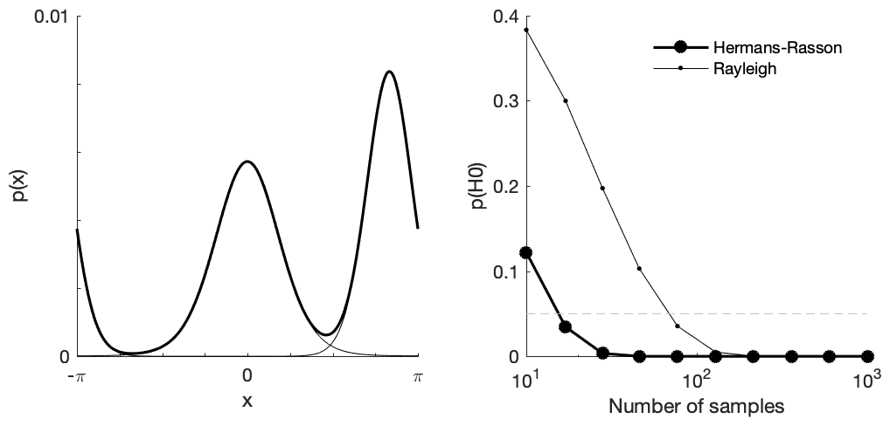

# hermans-rasson

A Matlab implementation of the Hermans-Rasson test for non-uniformity of circular data. The test is described in:

  Hermans M, Rasson J. (1985). A new Sobolev test for uniformity on the circle. Biometrika. 72:698–702. doi: 10.1093/biomet/72.3.698.

The Hermans-Rasson test can provide additional power (c.f. the Rayleigh test, for example) to reject the hypothesis of uniformity in cases where the distribution is multi-modal with unknown symmetry.

Example usage:
```
% multi-modal circular distribution, sum of von Mises distributions
kappa = [3 6];
xbar = [0 5*pi/6];

nsamp = round(logspace(1,3,10)); % number of samples

N = 1e3; % number of bootstrap samples

x = linspace(-pi,pi,361);

n = numel(kappa);
for ii = 1:n
  pdf(:,ii) = (2*pi/360)*circ_vmpdf(x(:), xbar(ii), kappa(ii))./n;
end

% plot pdfs
figure
subplot(1,2,1);
plot(x,pdf,'k-'); hold on

pdf = sum(pdf,2);

plot(x,pdf,'k-','LineWidth',1.5);

xlim(pi*[-1,1]);

% sample from the distribution
p = NaN([N,length(nsamp)]);
prayleigh = NaN([N,length(nsamp)]);
for ii = 1:length(nsamp)
  xhat = NaN([nsamp(ii),N]);
  for jj = 1:N
    xhat(:,jj) = randsample(x,nsamp(ii),true,pdf);

    prayleigh(jj,ii) = circ_rtest(xhat(:,jj));
  end

  p(:,ii) = hrtest(xhat);
end

% plot p(H0) vs nsamp
subplot(1,2,2);
semilogx(nsamp,mean(p),'ko-','LineWidth',1.5,'MarkerFaceColor','k'); hold on
semilogx(nsamp,mean(prayleigh),'k.-');
```

The example above produces something like:


For a comparison of several tests for non-uniformity and some recommendations on their relative merits, see:

  Landler L, Ruxton GD, Malkemper EP. (2018). Circular data in biology: advice for effectively implementing statistical procedures. Behavioral ecology and sociobiology. 72(8) 128. doi: 10.1007/s00265-018-2538-y.
